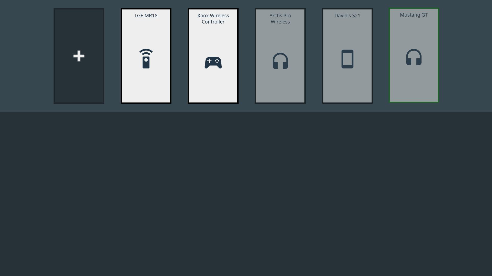

# WebOS Bluetooth HID

WebOS App to pair with a Bluetooth HID (mouse, keyboard, gamepad...)

Currently in pre-alpha.

## Features

- [x] Pair new devices
  - [x] Direct pairing
  - [ ] Confirmation code/passkey
- [x] Find your currently paired devices
- [ ] Unpair devices
- [x] Connect to a paired devices
- [ ] Disconnect from a paired device
- [x] HID can be used in natives app listing inputs (moonlight, retroarch...)
- [ ] HID can be used in all apps (including web apps)
